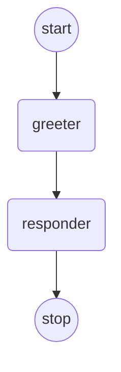
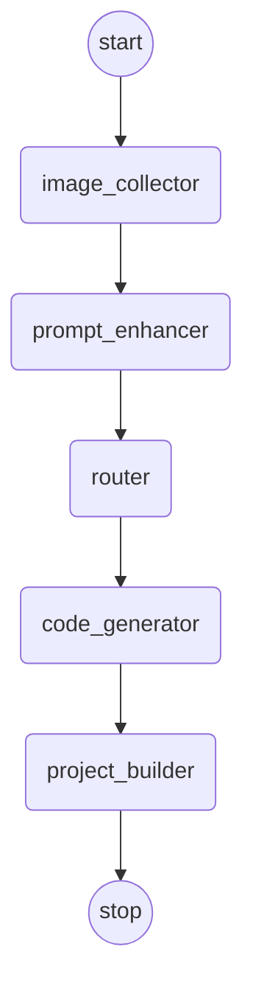
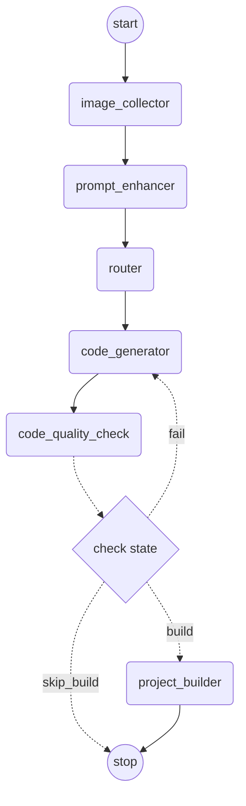
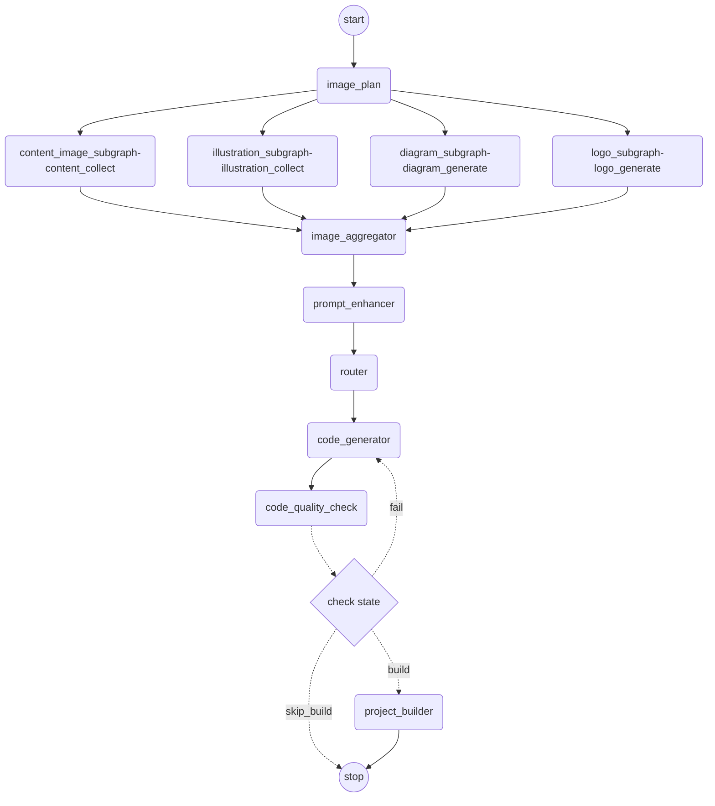

# AI工作流
工作流方案选型
LangGraph4j 入门
核心工作流开发
LangGraph4j工作流特性实战

如果想快速实现这个需求，其实只需要提供给AI图片搜索工具就好，交给框架和AI来决定什么时候调用工具，自动执行。
但是，之前鱼皮也提到了，对于可标准化的工作流程（搜集图片是在生成网站前的固定步骤），能标准化的建议标准化，
不要交给AI来自主判断，这样可以减少随机性和误差，而且还可以自主对流程进行新增、编排和优化。
因此，接下来会以一套新的网站生成方案+基于工作流来实现。
注意，跟之前已有的3种生成模式不同，本节我们不是在开发一种新的生成模式，而是一套新的系统实现方式。

## langgraph4j

### 1.StateGraph工作流图

在LangGraph4j中，StateGraph是主要使用的核心类，用于定义应用程序的结构。它将复杂的AI工作流抽象为一个有向图的概念。每个节点代表一个具体的操作单元，比如调用LLM生成文本、搜索外部数据、处理用户输入等。节点之间通过边来连接，多个节点之间通过状态来共享数据，形成了一个完整的处理流程。和传统的有向无环图(DAG)不同，LangGraph4j支持循环，比如一个智能体可能需要根据结果回到之前的步骤进行重试，或者需要在某个条件满足之前持续循环执行某个逻辑。
注意，使用图之前必须编译，编译过程不仅会进行基础的结构检查（比如检查是否有孤立的节点），还会定义运行时参数，创建一个不可变的、可运行的图CompiledGraph<S extends AgentState>。

### 2.AgentSatae




### 3.高级特性


## 具体开发

工作流开发的核心是：节点+边+状态+其他特性
具体步骤

1. 定义工作流结构（所有工作节点先只是临时输出、也无需记录状态）
2. 定义状态
3. 定义工作节点，先通过假数据模拟状态流转
4. 开发真实的工作节点
5. 工作流中使用节点，提供完整的工作流服务

### 1.定义工作流结构


```
帮我生成 LangGraph4j 工作流的代码

## 工作流的流程描述

// ... 补充具体的流程

## 要求

先生成基础的工作流结构代码，每个工作节点中只输出一句信息就够了，不用真正实现具体的业务逻辑。

## 参考信息

官方文档：@https://langgraph4j.github.io/langgraph4j/core/low_level/
示例工作流实现：@https://github.com/langgraph4j/langgraph4j-examples/blob/main/langchain4j/adaptive-rag/src/main/java/dev/langchain4j/adaptiverag/AdaptiveRag.java

```



### 2.定义状态


注意，java的类在进行序列化的时候最好要实现Serializable接口，为其提供以下功能
版本控制：确保序列化和反序列化时类的版本一致
兼容性检查：避免类结构变化导致的反序列化失败
安全性：防止恶意的序列化攻击

```java
        int stepCounter = 1;
        for (NodeOutput<MessagesState<String>> step : workflow.stream(Map.of(WorkflowContext.WORKFLOW_CONTEXT_KEY, initialContext))) {
            log.info("--- 第 {} 步完成 ---", stepCounter);
            // 显示当前状态
            WorkflowContext currentContext = WorkflowContext.getContext(step.state());
            if (currentContext != null) {
                log.info("当前步骤上下文: {}", currentContext);
            }
            stepCounter++;
        }
```

在调用workflow.stream方法的时候，框架内部会根据创建的节点开始进行节点的执行

```
// 框架内部大致流程：
// 1. 从START节点开始
// 2. 查找下一个要执行的节点（根据addEdge定义的路径）
// 3. 调用节点的apply()方法
// 4. 获取返回结果，更新状态
// 5. 继续下一个节点，直到END
```

### 3.节点逻辑

**图片收集节点**
图片收集节点的作用是根据用户提示词获取到网站所需的图片。
我们怎么知道网站需要什么图片呢？
不妨让AI来判断吧！通过给AI提供各种不同类型的图片收集工具，来AI调用工具来获取网站所需的不同类型的图片，
并且直接利用结构化输出特性获取到最终的图片列表。

## 高级特性





