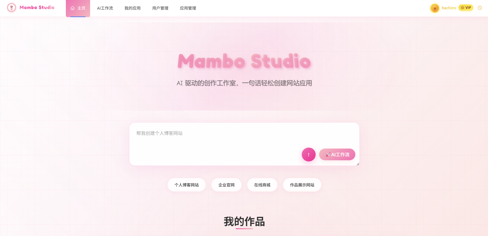
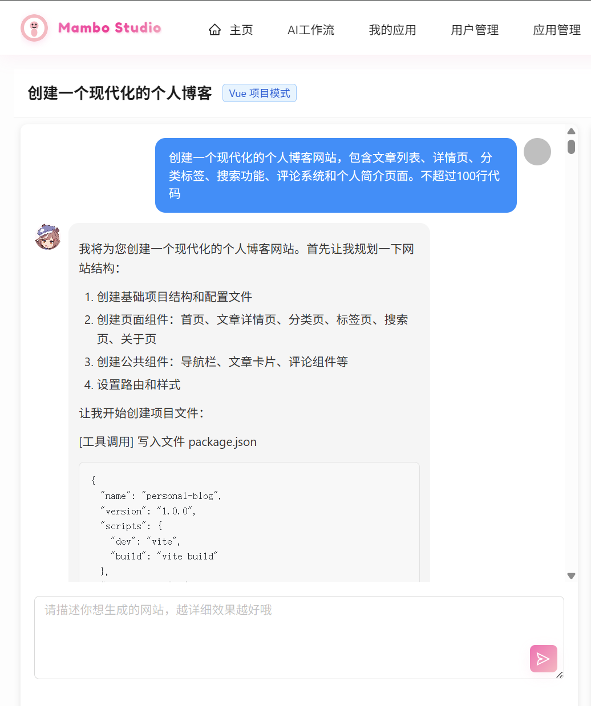
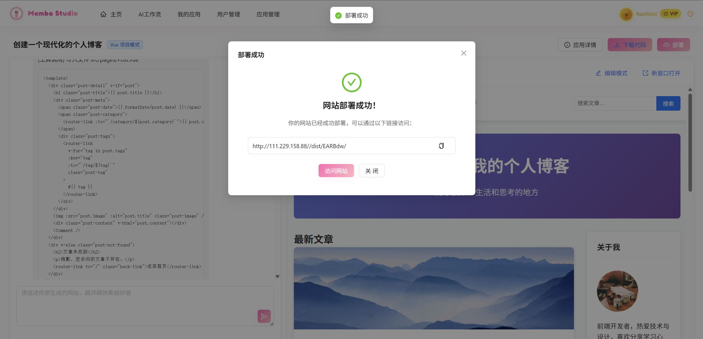
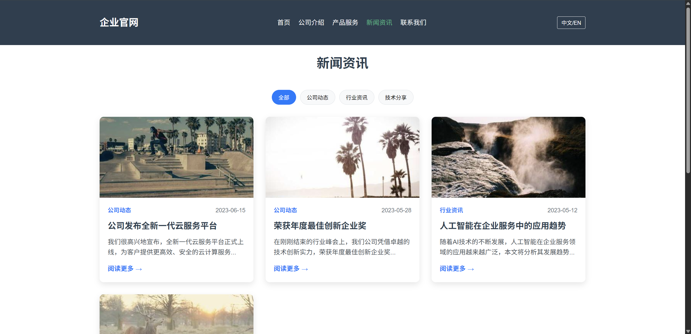
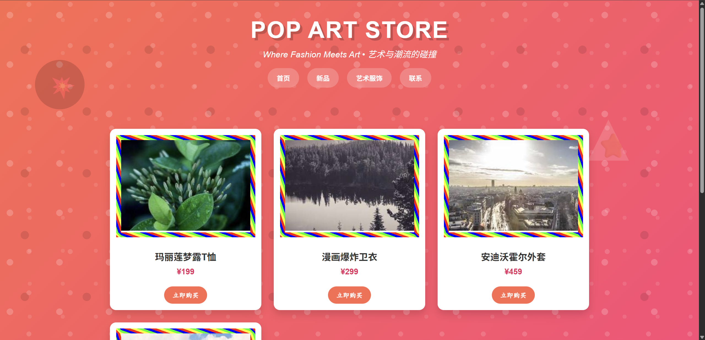
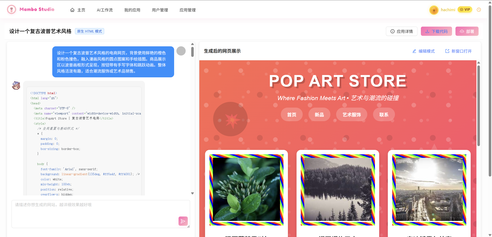
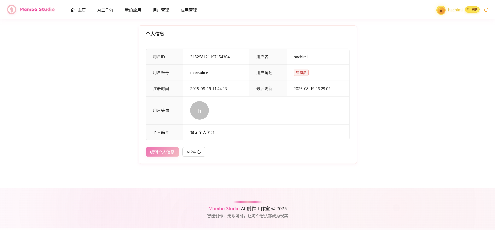
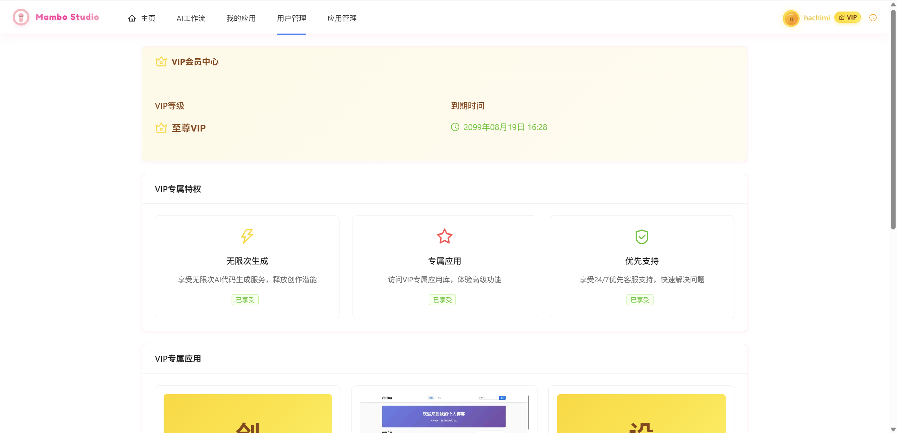
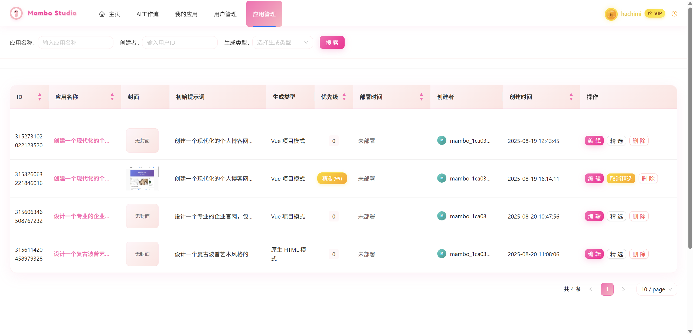
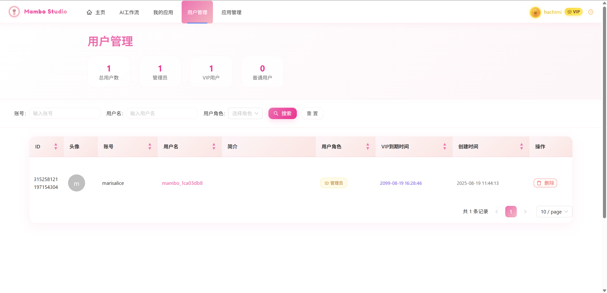

# 🎨 MamboStudio

<div align="center">


**智能 AI 代码生成平台** - 让 AI 帮你生成完整的 Web 应用

[](https://spring.io/projects/spring-boot)
[](https://vuejs.org/)
[](https://github.com/langchain4j/langchain4j)
[](LICENSE)

[快速开始](#快速开始) • [功能特性](#功能特性) • [技术架构](#技术架构) • [部署指南](#部署指南) • [贡献指南](#贡献指南)

</div>

## ✨ 项目简介

MamboStudio 是一个基于 **Spring Boot 3 + LangChain4j + Vue 3** 构建的企业级 AI 代码生成平台。通过自然语言描述，AI 可以自动生成完整的 Web 应用，支持多种项目[...]

### 🎯 核心亮点

- 🤖 **智能代码生成**: 支持 HTML、多文件项目、Vue 工程等多种生成模式
- 🎯 **可视化编辑**: 点选网页元素，实时交互修改，"点哪儿改哪儿"
- 🔄 **实时流式响应**: 基于 SSE 的实时 AI 对话体验
- 📱 **响应式设计**: 完美适配桌面端和移动端
- 🛠️ **增量修改**: 针对复杂项目提供精确的文件级修改工具
- 🛡️ **企业级架构**: 完整的用户管理、权限控制、监控体系
- 🚀 **一键部署**: 生成的应用可直接访问和部署
- 💎 **精选案例**: 展示高质量 AI 生成应用

## 📸 产品展示

### 🏠 主页 - AI 代码生成



### 💬 AI 对话生成 - 实时流式响应



### 🎯 代码预览 - 一键部署



### 💎 精选案例 - 应用展示






## 🚀 快速开始

### 环境要求

- **Java**: JDK 21+
- **Node.js**: 20.0+
- **MySQL**: 8.0+
- **Redis**: 6.0+

### 1. 克隆项目

```bash
git clone https://github.com/Marisalice114/mambo-studio.git
cd mambo-studio
```

### 2. 配置环境

```bash
# 复制配置示例文件
cp application-example.yml src/main/resources/application-local.yml

# 编辑配置文件，填入您的API密钥和数据库信息
vim src/main/resources/application-local.yml
```

### 3. 启动后端

```bash
# 使用Maven启动
mvn spring-boot:run -Dspring.profiles.active=local

# 或使用IDE直接运行 MamboAiPlatformApplication.java
```

### 4. 启动前端

```bash
cd mambo-ai-platform-frontend
npm install
npm run dev
```

### 5. 访问应用

- **前端应用**: http://localhost:5173
- **后端 API**: http://localhost:8234/api
- **API 文档**: http://localhost:8234/api/doc.html

详情请参考 [SETUP.md](SETUP.md)。

## ✨ 功能特性

### 🎨 AI 代码生成

- **多模式生成**: HTML 单文件、多文件项目、Vue 完整工程
- **智能路由**: 根据需求自动选择最适合的 AI 模型
- **实时预览**: 生成过程中实时查看代码和效果
- **一键部署**: 生成后自动部署，获得可访问链接



### 🎯 可视化编辑系统

- **点选编辑**: 直接点击网页元素进行选择和编辑
- **实时交互**: iframe 内嵌预览，支持跨框架通信
- **精确定位**: 智能元素选择器，准确定位修改目标
- **增量修改**: 针对 Vue 工程提供文件级增量修改工具
- **AI 辅助**: 结合自然语言描述进行精确元素修改


### 👥 用户体系

- **用户注册/登录**: 完整的用户认证体系
- **VIP 会员**: 高级功能和无限生成次数
- **个人中心**: 管理个人信息和应用
- **应用管理**: 查看、编辑、删除个人应用





### 🛡️ 管理后台

- **用户管理**: 用户信息查看、VIP 状态管理
- **应用管理**: 全局应用监控、精选设置
- **对话管理**: AI 对话历史追踪
- **数据统计**: 平台使用数据分析





### 🔧 企业特性

- **会话管理**: Redis 持久化的用户会话
- **缓存优化**: 多层缓存提升性能
- **限流保护**: 防止 API 滥用
- **监控告警**: Prometheus + Grafana 监控
- **安全防护**: XSS 防护、SQL 注入防护

## 🏗️ 技术架构

### 后端技术栈

- **框架**: Spring Boot 3.x
- **AI 引擎**: LangChain4j
- **数据库**: MySQL + MyBatis-Flex
- **缓存**: Redis + Caffeine
- **监控**: Prometheus + Grafana
- **文档**: Knife4j (Swagger)

### 前端技术栈

- **框架**: Vue 3 + TypeScript
- **UI 库**: Ant Design Vue
- **构建工具**: Vite
- **状态管理**: Pinia
- **HTTP 客户端**: Axios

### 核心架构模式

- **工厂模式**: AI 服务实例管理
- **门面模式**: 统一的 AI 服务入口
- **适配器模式**: 多种 AI 模型适配
- **观察者模式**: 实时流式响应
- **跨框架通信**: iframe 与父页面的消息传递机制

### 可视化编辑技术栈

- **元素检测**: DOM 事件监听 + CSS 选择器生成
- **跨域通信**: PostMessage API 实现 iframe 双向通信
- **状态同步**: 编辑模式状态管理与视觉反馈
- **增量修改**: 基于 LangChain4j 工具调用的精确文件操作
- **实时注入**: 动态脚本注入实现可视化编辑功能

## 📚 API 文档

启动应用后，访问以下地址查看完整 API 文档：

- **Swagger UI**: http://localhost:8234/api/doc.html
- **OpenAPI 规范**: http://localhost:8234/api/v3/api-docs

### 核心 API

```bash
# 用户相关
POST /api/user/register     # 用户注册
POST /api/user/login        # 用户登录
GET  /api/user/get/login    # 获取当前用户

# 应用相关
POST /api/app/add           # 创建应用
GET  /api/app/list/page     # 获取应用列表
POST /api/app/update        # 更新应用

# AI生成
POST /api/chat/gen/code     # AI代码生成 (SSE流式响应)

# 可视化编辑
POST /api/chat/edit/element # 可视化元素编辑
GET  /api/app/preview/{id}  # 应用预览页面
POST /api/file/modify       # 文件增量修改
```

## 🛠️ 部署指南

### Docker 部署

```bash
# 构建镜像
docker build -t mambo-ai-platform .

# 运行容器
docker run -d -p 8234:8234 \
  -e SPRING_PROFILES_ACTIVE=prod \
  -e DB_HOST=your_db_host \
  -e REDIS_HOST=your_redis_host \
  mambo-ai-platform
```

### 传统部署

```bash
# 构建项目
mvn clean package -DskipTests

# 运行JAR文件
java -jar mambo-ai-platform-*.jar --spring.profiles.active=prod
```

## 📖 开发指南

### 项目结构

```
mambo-ai-platform/
├── src/main/java/
│   ├── controller/         # 控制器层
│   ├── service/           # 业务逻辑层
│   ├── model/             # 数据模型
│   ├── config/            # 配置类
│   └── utils/             # 工具类
├── src/main/resources/
│   ├── mapper/            # MyBatis映射文件
│   ├── prompt/            # AI提示词模板
│   └── sql/               # 数据库脚本
├── mambo-ai-platform-frontend/  # Vue前端项目
│   ├── src/utils/visualEditor.ts  # 可视化编辑核心类
│   ├── src/pages/app/AppChatPage.vue  # AI对话和编辑界面
│   └── src/api/           # 自动生成的API客户端
└── docs/                  # 项目文档
```

## 🤝 贡献指南

我们欢迎所有形式的贡献！

### 贡献方式

1. **Fork** 本项目
2. **创建** 功能分支 (`git checkout -b feature/amazing-feature`)
3. **提交** 更改 (`git commit -m 'Add some amazing feature'`)
4. **推送** 到分支 (`git push origin feature/amazing-feature`)
5. **开启** Pull Request

### 开发者

- [@Marisalice114](https://github.com/Marisalice114) - 项目维护者

## 📄 许可证

本项目基于 [MIT License](LICENSE) 开源协议。

## 🙏 致谢

- [LangChain4j](https://github.com/langchain4j/langchain4j) - Java AI 框架
- [Spring Boot](https://spring.io/projects/spring-boot) - Java Web 框架
- [Vue.js](https://vuejs.org/) - 前端框架
- [Ant Design Vue](https://antdv.com/) - UI 组件库

## 📞 联系我们

- **Issues**: [GitHub Issues](https://github.com/your-username/mambo-ai-platform/issues)
- **Discussions**: [GitHub Discussions](https://github.com/your-username/mambo-ai-platform/discussions)

---

<div align="center">
  <sub>Built with ❤️ by the Mambo AI Platform team</sub>
</div>
